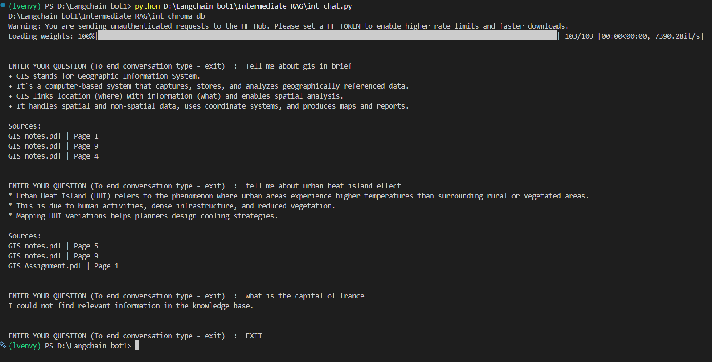
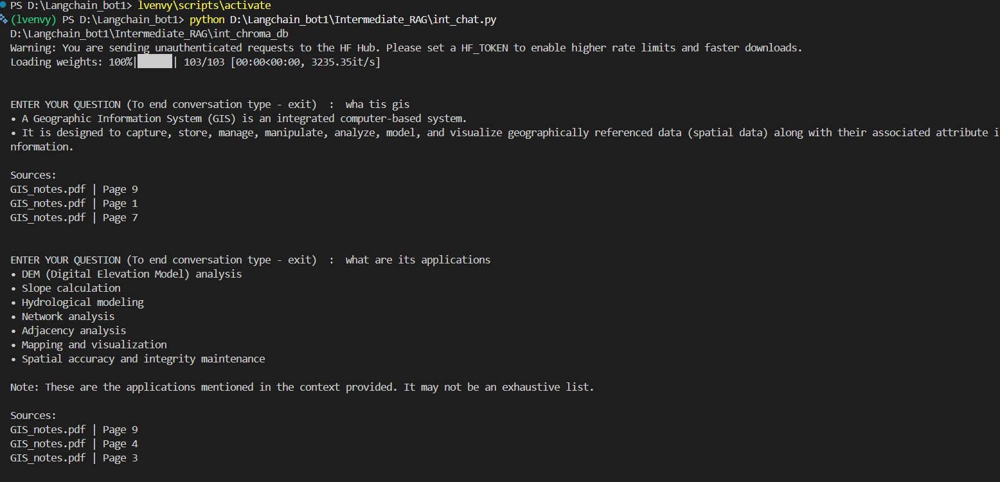

# RAG with LangChain Learning Journey: From Basic to Advanced Retrieval-Augmented Generation







## Overview

This repository documents my journey of learning and building Retrieval-Augmented Generation (RAG) systems using LangChain.

Instead of building a single project, I progressively improved the architecture, retrieval quality, and user experience through multiple versions.

The goal is to understand not only *how* to build a RAG system, but also *why* each design decision matters.

---

## Learning Roadmap

```text
Basic_RAG
    ↓
Intermediate_RAG
    ↓
Advanced_RAG (Planned)
```

---

# Phase 1: Basic RAG

## Goal

Build a simple PDF chatbot capable of answering questions from a single document.

## Features

* Single PDF ingestion
* PDF chunking
* Hugging Face embeddings
* Chroma vector database
* Similarity search
* PromptTemplate
* LCEL chains
* Command-line chatbot

## Architecture

```text
PDF
 ↓
Loader
 ↓
Chunking
 ↓
Embeddings
 ↓
ChromaDB
 ↓
Similarity Search
 ↓
Prompt
 ↓
LLM
 ↓
Answer
```

## Key Concepts Learned

* Documents vs Strings
* Chunking strategies
* Embeddings
* Vector databases
* Similarity search
* Prompt templates
* LangChain chains

---

# Phase 2: Intermediate RAG

## Goal

Improve retrieval quality and support a real knowledge base.

## Improvements Over Basic RAG

### Multi-PDF Knowledge Base

Instead of a single PDF:

```text
pdf_folder/
├── GIS_notes.pdf
├── GIS_Assignment.pdf
├── RemoteSensing.pdf
```

All documents are indexed together.

---

### Persistent Vector Database

Embeddings are generated once and stored locally.

```text
Ingestion
 ↓
Store Embeddings
 ↓
Reuse Database
```

---

### Retriever Abstraction

Moved from:

```python
vectorstore.similarity_search(...)
```

to:

```python
retriever.invoke(...)
```

This introduced the Retriever abstraction used throughout LangChain.

---

### MMR Retrieval

Implemented:

```python
search_type="mmr"
```

to improve retrieval diversity and reduce duplicate information.

---

### Source Citations

Added support for:

```text
GIS_notes.pdf | Page 3
GIS_Assignment.pdf | Page 1
```

This improves transparency and trustworthiness.

---

### Retrieval Debugging

Added retrieval inspection mode to evaluate:

* Retrieved chunks
* Metadata
* Retrieval quality

This helped identify whether errors originated from retrieval or generation.

---

### Better Prompt Engineering

Improved prompt design to:

* Use only retrieved context
* Avoid hallucinations
* Refuse answers not present in the knowledge base

---
### Conversational Memory

Added chat history support to enable multi-turn conversations.

Instead of treating every question independently, the chatbot now maintains conversation history and injects it into the prompt.

Example:

User:

```text
What is GIS?
```

Assistant:

```text
GIS is a Geographic Information System.
```

User:

```text
What are its applications?
```

The chatbot can resolve references such as "its" by using previous conversation history while continuing to ground factual answers in retrieved documents.

This introduced an important distinction between:

* Retrieval → Provides factual knowledge from documents.
* Memory → Provides conversational context from previous interactions.
---

## Architecture

```text
PDF Folder
      ↓
DirectoryLoader
      ↓
Chunking
      ↓
Embeddings
      ↓
ChromaDB
      ↓
Retriever (MMR)
      ↓
Retrieved Context

Conversation History
      ↓

Prompt Template
      ↓
LLM
      ↓
Answer + Citations
```
---

## Key Concepts Learned

* Multi-document RAG
* Retriever abstraction
* MMR retrieval
* Source grounding
* Citation handling
* Metadata management
* Retrieval debugging
* Better prompt design
* Conversational memory
* Multi-turn dialogue handling
* Context vs Memory separation

---

# Lessons Learned

One of the biggest lessons from this project was:

> Good RAG systems depend as much on retrieval quality as they do on model quality.

A stronger model cannot compensate for poor retrieval.

Understanding retrieval became more important than simply changing LLMs.

---

# Future Work (Advanced RAG)

The next phase of the project will focus on more advanced retrieval and production-ready features.

## Planned Improvements

### Streamlit UI

Replace the command-line interface with a web-based chat experience.

### Retrieval Confidence Scoring

Determine whether retrieved documents are relevant enough before generating an answer.

### Score Threshold Filtering

Avoid answering when retrieval confidence is too low.

### Memory Summarization

Enable follow-up questions and multi-turn conversations for long conversations too.

### Hybrid Search

Combine:

```text
Keyword Search
+
Vector Search
```

for better retrieval performance.

### Reranking

Use rerankers to improve retrieval quality before sending context to the LLM.

### Full LCEL Retrieval Chains

Move toward fully composable LangChain pipelines.

### Evaluation Framework

Measure:

* Retrieval quality
* Answer quality
* Hallucination rate

---

# Tech Stack

* Python
* LangChain
* ChromaDB
* Hugging Face Embeddings
* Hugging Face Inference API
* PyPDFLoader
* DirectoryLoader

---

# Repository Structure

```text
Langchain_Bot/

├── Basic_RAG/
│   ├── chat.py
│   ├── ingest.py
│   ├── prompts.py
│   └── README.md
│
├── Intermediate_RAG/
│   ├── int_chat.py
│   ├── int_ingest.py
│   ├── int_prompt.py
│   └── README.md
│
└── README.md
```

---

# Final Reflection

This repository is not just a collection of RAG projects. It is a record of the progression from understanding basic retrieval concepts to building increasingly capable and reliable knowledge-grounded AI systems.

Each version focuses on solving limitations discovered in the previous one while keeping the implementation understandable and educational.
