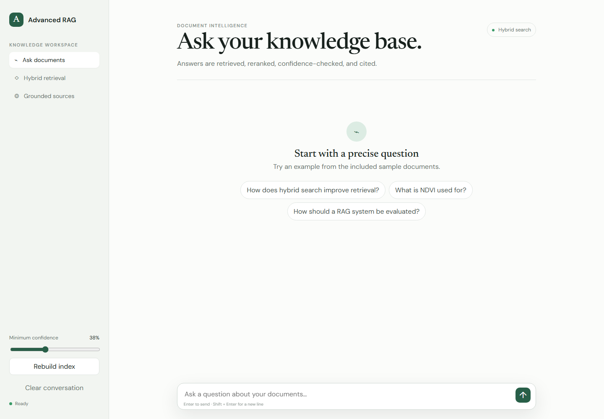

# Advanced RAG

This folder builds on the repository's `Intermediate_RAG` version without modifying it. It keeps the same understandable flow—load documents, chunk them, persist embeddings, retrieve context, answer, and cite sources—then implements every item under **Future Work (Advanced RAG)** in the root README.

The browser interface is plain HTML, CSS, and JavaScript. FastAPI only serves the files and provides JSON endpoints; no frontend framework or Streamlit is used.



## What is implemented

- Multi-document ingestion for PDF, Markdown, and text files
- Persistent Chroma vector database with portable project-relative paths
- Hybrid BM25 keyword search and dense vector search
- Cross-encoder reranking of the combined candidate set
- Retrieval confidence scoring and adjustable score-threshold refusal
- Per-browser conversational memory with automatic summarization
- Source citations, page metadata, passage previews, and retrieval scores
- Composable LCEL retrieval and generation pipelines
- Responsive raw HTML/CSS/JS chat interface
- Retrieval evaluation set, answer checks, and unit tests
- Five additional sample knowledge documents

## Architecture

```text
PDF / Markdown / text
        ↓
load → chunk → Hugging Face embeddings → persistent Chroma
        └──────────────────────────────→ cached chunks → BM25
                                                     ↓
Question → vector candidates + keyword candidates → score fusion
                                                     ↓
                                         cross-encoder reranking
                                                     ↓
                                          confidence threshold
                                             ↙               ↘
                                      safe refusal     grounded LCEL prompt
                                                              ↓
                                               answer + numbered citations

Conversation → recent messages → summary when long → reference resolution
```

## Run locally

Python 3.10 or newer is recommended.

```bash
cd "advanced rag"
python -m venv .venv
```

Activate the environment on Windows:

```powershell
.venv\Scripts\Activate.ps1
```

Install and configure:

```bash
pip install -r requirements.txt
copy .env.example .env
```

Put a Hugging Face access token in `.env`. The embedding and reranking models are downloaded on first use. Then build the index and start the API/UI:

```bash
python ingest.py
uvicorn app:app --reload
```

Open <http://127.0.0.1:8000>. API documentation is available at <http://127.0.0.1:8000/docs>.

You can add `.pdf`, `.md`, or `.txt` files to `sample_documents/`, then run `python ingest.py` again or click **Rebuild index** in the interface.

## Configuration

| Variable | Default | Purpose |
|---|---|---|
| `HUGGINGFACEHUB_ACCESS_TOKEN` | none | Required for generated answers |
| `HF_LLM_REPO` | `meta-llama/Llama-3.1-8B-Instruct` | Hugging Face chat model |
| `EMBEDDING_MODEL` | `sentence-transformers/all-MiniLM-L6-v2` | Dense retrieval model |
| `RERANK_MODEL` | `cross-encoder/ms-marco-MiniLM-L-6-v2` | Candidate reranker |
| `RERANK_ENABLED` | `true` | Enable/disable cross-encoder reranking |
| `CONFIDENCE_THRESHOLD` | `0.38` | Default refusal threshold |

Threshold values are system-specific. Tune the default against representative questions using the evaluation harness rather than treating `0.38` as universally calibrated.

## Evaluation and tests

Build the index before evaluation:

```bash
python evaluate.py
python evaluate.py --answers
pytest -q
```

The default evaluation measures whether the expected source appears in the retrieved results and whether an out-of-scope question falls below the threshold. `--answers` additionally calls the LLM and records expected-term coverage and refusal behavior. Detailed output is written to `evaluation/results.json` and intentionally ignored by Git.

## Important production notes

This is an educational local application. Before exposing it publicly, add authentication, authorization-aware retrieval, rate limiting, durable session storage, secret management, and structured observability. Do not rely on prompt text as an access-control boundary.
